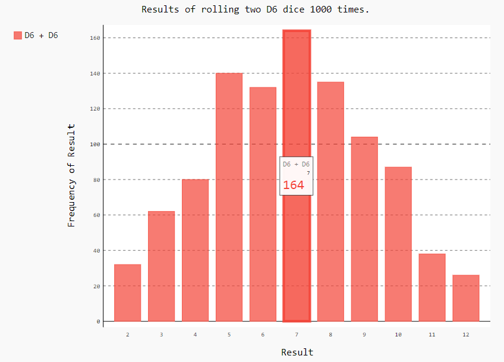
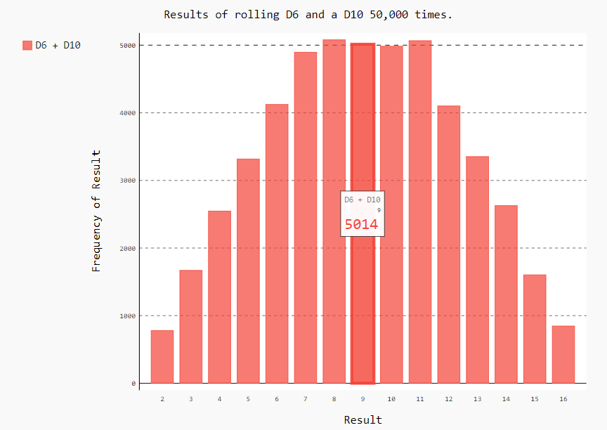

# data_visualization
## A data visualization project (using matplotlib pygal)

| square numbers | random 50000 steps walk with start and end points |
| ------------ | ------------- |
|  |  |

| rolling two D6 dice 1000 times | rolling D6 and a D10 50,000 times |
| ------------ | ------------- |
|  |  |
